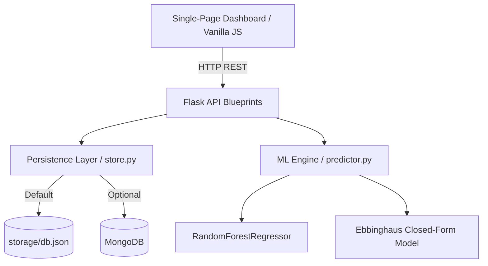
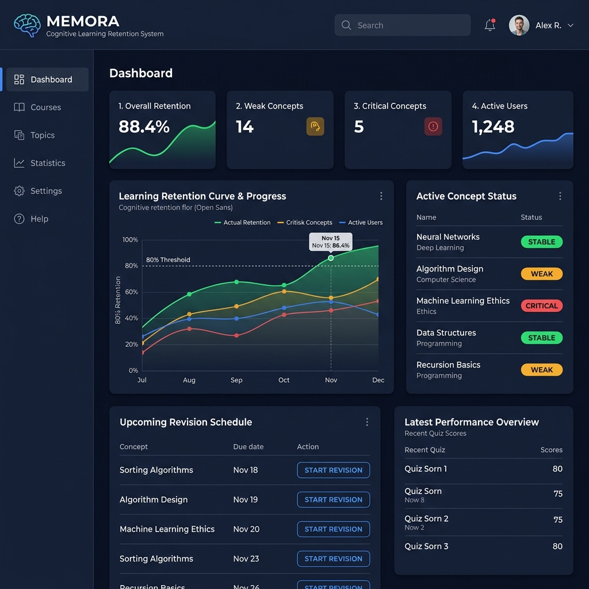
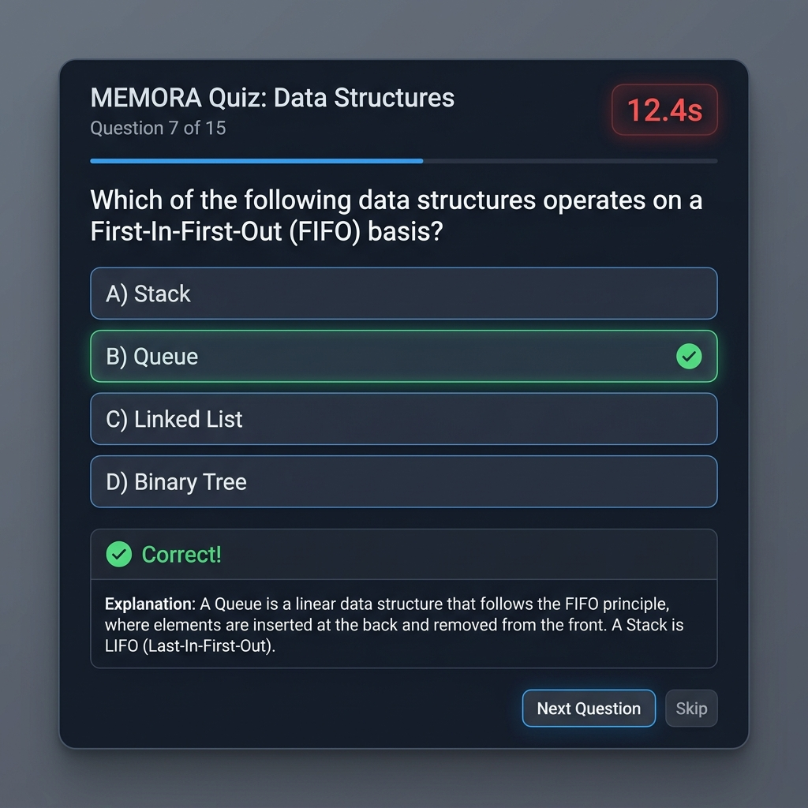

# MEMORA — Cognitive Learning Retention Intelligence System


MEMORA is an intelligent cognitive learning retention system built for CS5403 Machine Learning PBL. It fuses the mathematical **Ebbinghaus Forgetting Curve** $R(t) = e^{-t/S}$ with a **RandomForestRegressor** machine learning model to predict student memory retention, flag weak concepts, deliver server-side graded quizzes, and generate adaptive revision schedules.



---

## Quick Start

Execute these commands from the repository root:

```bash
# 1. Clone & setup environment
git clone https://github.com/hariharan112277-sudo/MEMORA.git
cd MEMORA
python -m venv .venv
source .venv/bin/activate  # On Windows: .venv\Scripts\activate

# 2. Install dependencies
pip install -r requirements.txt -r requirements-dev.txt

# 3. Generate dataset v2 & train ML model
python data/generate_dataset.py   # Wrote 5,200 rows
python ml/train_model.py          # Saves model + metrics.json

# 4. Start the server
python app.py
```

Then visit **`http://localhost:5000/dashboard`** in your browser to access the single-page dashboard.

Run post-installation verification:
```bash
bash scripts/verify.sh
```

---

## Interface Screenshots

### Dashboard Overview & Retention Curve


### Server-Side Graded Quiz Engine


---

## Dashboard Features

- **KPI Cards**: Overall learner retention %, count of Stable ($\ge 75\%$), Weak ($50-75\%$), and Critical ($< 50\%$) concepts.
- **Tracked Concepts List**: Color-coded retention progress bars, days since review, memory strength $S$, and quick revision triggers.
- **Priority Weak Panel**: Filtered list of concepts needing immediate attention sorted worst-first.
- **Revision Schedule**: Overdue items highlighted in red with exact overdue days, followed by upcoming due items.
- **Interactive Quiz Engine**: 100-question bank across 10 undergraduate CS concepts with per-question timers and immediate server-side feedback.
- **Retention Curve & Trend Charts**: Interactive Chart.js visualizations showing predicted decay curves against an 80% threshold line and historical daily retention trends.
- **Day Simulator**: Advance time by 1 day or custom $N$ days to observe simulated memory decay across all concepts.

---

## How the Model Works

### 1. Mathematical Foundation (Ebbinghaus Decay)
Retention probability $R(t)$ decays exponentially over time $t$ (days since last review) according to memory strength $S$:
$$R(t) = e^{-\frac{t}{S}}$$

- **Success**: Correct quiz response increases strength: $S_{\text{new}} = S_{\text{old}} \times (1.4 + 0.4 \times (1 - \text{difficulty}))$.
- **Failure**: Incorrect response reduces strength: $S_{\text{new}} = \max(1.0, S_{\text{old}} \times 0.55)$.

### 2. Machine Learning Fusion (Random Forest)
A `RandomForestRegressor` trained on 5,200 simulated learner attempts predicts real-world retention using 5 features:
1. `days_since_last_review`
2. `quiz_accuracy` (rolling mean over last 10 attempts)
3. `response_time` (average seconds per question)
4. `attempt_count` (total revisions)
5. `difficulty` (0.0 to 1.0)

### 3. Feature Importances (Dataset v2)
In Dataset v2, label leakage was mitigated by decoupling true memory retention from observed quiz metrics.

| Feature | Importance | Description |
| :--- | :--- | :--- |
| `days_since_last_review` | **0.9317** | Time elapsed since concept was last revised |
| `quiz_accuracy` | **0.0411** | Rolling accuracy over recent attempts |
| `difficulty` | **0.0172** | Subjective domain difficulty |
| `response_time` | **0.0079** | Average recall latency |
| `attempt_count` | **0.0021** | Total practice repetitions |

Metrics log: `models/metrics.json` ($R^2 = 0.9158$, $\text{MAE} = 0.0571$).

---

## Complete API Surface

| Method | Endpoint | Description | Sample Request Payload | Sample Response Signature |
| :--- | :--- | :--- | :--- | :--- |
| **GET** | `/dashboard` | Single-page UI dashboard | None | `HTML Document` |
| **GET** | `/api/health` | Service health status | None | `{"status":"ok","ml_model_loaded":true}` |
| **GET** | `/api/learners` | List all learners | None | `{"learners":[{"learner_id":"L_HARIHARAN",...}]}` |
| **POST** | `/api/learners` | Create new learner | `{"name":"Priya Sharma"}` | `{"learner_id":"L_PRIYA_SHARMA",...}` (201) |
| **GET** | `/api/learners/<id>` | Full learner profile | None | `{"learner_id":"...","concepts":[...]}` |
| **DELETE** | `/api/learners/<id>` | Delete learner | None | `204 No Content` |
| **POST** | `/api/learners/<id>/concepts` | Add concept | `{"name":"Graph Theory","difficulty":0.5}` | `{"concept_id":"graph_theory",...}` (201) |
| **DELETE** | `/api/learners/<id>/concepts/<cid>` | Delete concept | None | `204 No Content` |
| **GET** | `/api/concepts?learner_id=` | List learner concepts | Query: `?learner_id=L_HARIHARAN` | `{"current_day":0,"concepts":[...]}` |
| **GET** | `/api/concepts/weak?learner_id=` | List weak concepts | Query: `?learner_id=L_HARIHARAN` | `{"weak_concepts":[...]}` |
| **GET** | `/api/analytics?learner_id=` | Dashboard KPIs & trend | Query: `?learner_id=L_HARIHARAN` | `{"overall_retention":0.62,"trend":[...]}` |
| **POST** | `/api/retention/predict` | Predict retention & curve | `{"learner_id":"L_HARIHARAN","concept_id":"data_structures"}` | `{"retention_formula":0.8,"retention_ml":0.81,...}` |
| **POST** | `/api/schedule/generate` | Overdue-aware schedule | `{"learner_id":"L_HARIHARAN","threshold":0.8}` | `{"overdue_count":2,"schedule":[...]}` |
| **GET** | `/api/quiz/questions` | Bank questions (no leak) | Query: `?learner_id=...&concept_id=...&limit=5` | `{"questions":[{"id":"ds_q01","text":"...",...}]}` |
| **POST** | `/api/quiz/attempt` | Server-side graded attempt | `{"learner_id":"...","concept_id":"...","question_id":"ds_q01","selected_option":1}` | `{"correct":true,"new_strength":13.3,...}` |
| **POST** | `/api/quiz/submit` | Fallback quiz submission | `{"learner_id":"...","concept_id":"...","correct":true}` | `{"new_strength":13.3,"review_count":1,...}` |
| **POST** | `/api/day/advance` | Advance simulator time | `{"by": 1}` | `{"current_day": 1}` |
| **POST** | `/api/reset` | Reset state to seed data | None | `{"status":"reset complete","current_day":0}` |

---

## Deployment & Production Notes

### Docker

Build and run using Docker:
```bash
docker build -t memora-backend .
docker run -p 5000:5000 memora-backend
```

### Environment Configuration

Configure variables via `.env`:
```ini
PORT=5000
DEBUG=false
STORAGE_BACKEND=json # "json" or "mongo"
MONGO_URI=mongodb://localhost:27017
MONGO_DB=memora
RETENTION_THRESHOLD=0.8
CORS_ORIGIN=*
```

---

## License

MIT License. Copyright (c) 2026 S R Hariharan.
